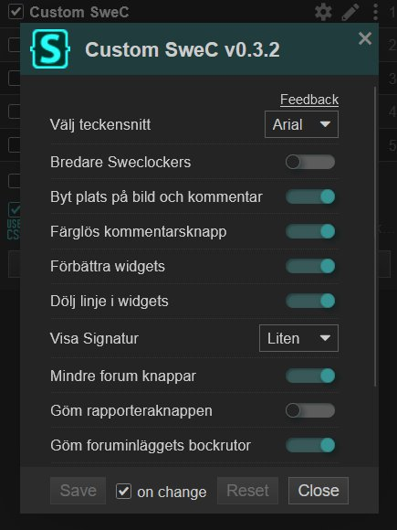
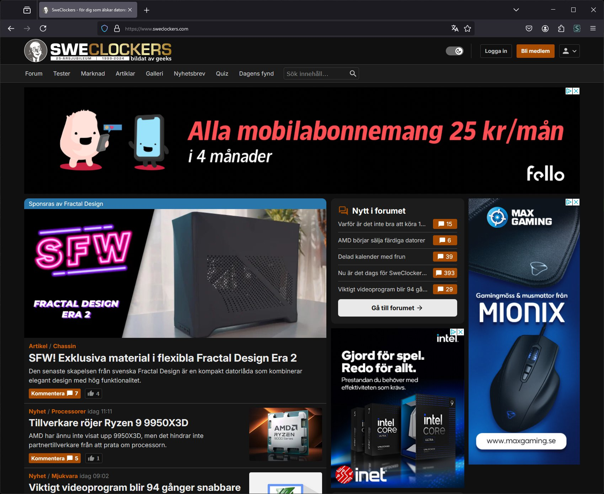

# Custom SweC

Custom SweC is a UserCSS script for the site [Sweclockers.com](https://sweclockers.com)

This script is created so that you be able to change certain objects on the website, e.g. change size, color or move some object around.

This script must be used together with Stylus to work, first install Stylus in your browser and then press the link below.
Please note that I have not tested whether all features work properly on all sizes and resolutions.
Preferably leave ideas and bug fixes on Sweclocker's associated forum thread

[Install Custom SweC](https://raw.githubusercontent.com/rlagers/CustomSweC/main/customswec.user.styl)

Config look like this:

Exemple with or without Custom SweC default settings

With:

Without:

Change within the forum:

With:

Without:

